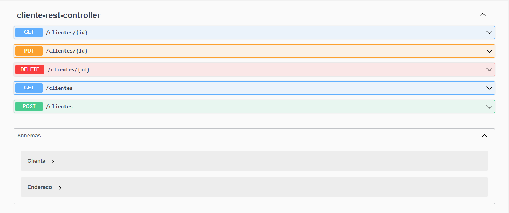

# Explorando Padrões de Projeto na Prática com Java
Este repositório contém implementações práticas de padrões de projeto em Java, enfocando sua aplicação no contexto do Spring Framework. Os principais padrões de projeto abordados são:

- Singleton: O padrão Singleton garante que uma classe tenha apenas uma instância e fornece um ponto de acesso global para essa instância.

Strategy/Repository: Embora mencionados separadamente, esses padrões têm suas próprias funcionalidades distintas:

- Strategy: O padrão Strategy permite definir uma família de algoritmos, encapsulá-los.
- Repository: O padrão Repository é amplamente utilizado para acessar e gerenciar dados em um banco de dados.
- Facade: O padrão Facade é empregado para fornecer uma interface simplificada para um conjunto de interfaces em um subsistema mais amplo.

Além disso, este projeto foi construído usando o Spring Boot, uma estrutura que simplifica o desenvolvimento de aplicativos Spring, automatizando muitos aspectos da configuração. A configuração inicial foi facilitada pelo Spring Initializr, que ajuda a criar rapidamente projetos Spring Boot com as dependências necessárias.

Dependencias deste projeto incluem criadas :

- Spring Data JPA
- Spring Web
- H2 Database
- OpenFeign

Espero que este repositório ajude a entender e aplicar esses padrões de projeto em cenários do mundo real com o poder e a simplicidade do ecossistema Spring.
- OpenAPI/Swagger

